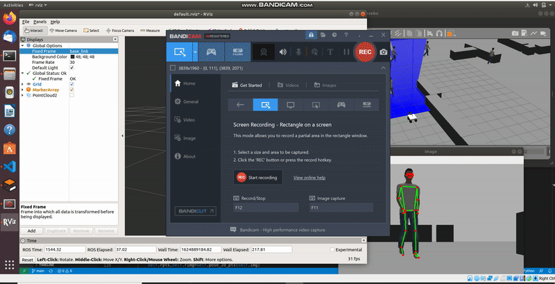
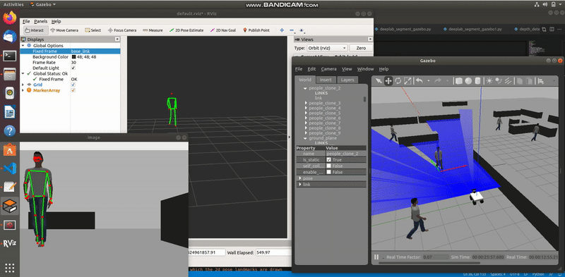
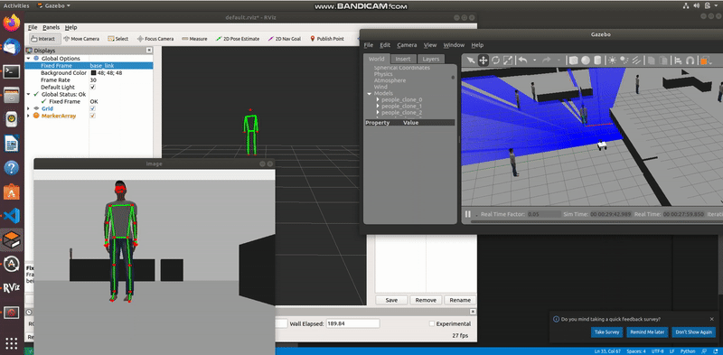

# 3d_Human_Pose_Estimation_ROS_Cpu

This repo contains code that takes in estimated 2d anatomical landmarks in image coordinate(u,v) and convert them to world coordinate(x,y,z).Also,these projected landmarks are displayed in rviz with the help of sphere markers(joints) that are joined together with line markers(links). Here I have used two approaches to estimate the 3d landmarks.

1.To get world coordinate(x,y,z) from camera intrinsic parameters: (see 3dposedepth.py) 
    Z = depth_image[v,u]  
    X = (u - cx) * Z / fx  
    Y = (v - cy) * Z / fy  
    
where,  
cx=X-axis optical center in pixels  
cy=Y-axis optical center in pixels.  
fx=X-axis focal length in meters  
fy=X-axis focal length in meters  

2.Using the existing pc2.read_points function which takes in pointcloud and 2d anatomical landmark(in img coordinate) and returns the same point in world coordinate. (see 3dposepcl.py)

 

## Output

  

 
 
 

## Output First Approach

  

 
 
 

## Output Second Approach

  

 
  
I personally found that first approach was faster than the second one. For the second approach, after moving human model in gazebo it took some time for 3d pose to appear in Rviz. 

### PS: I tested these codes in Ubuntu 18 VM without GPU
